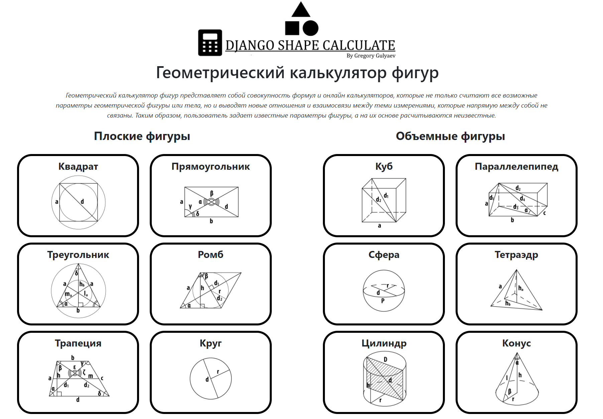
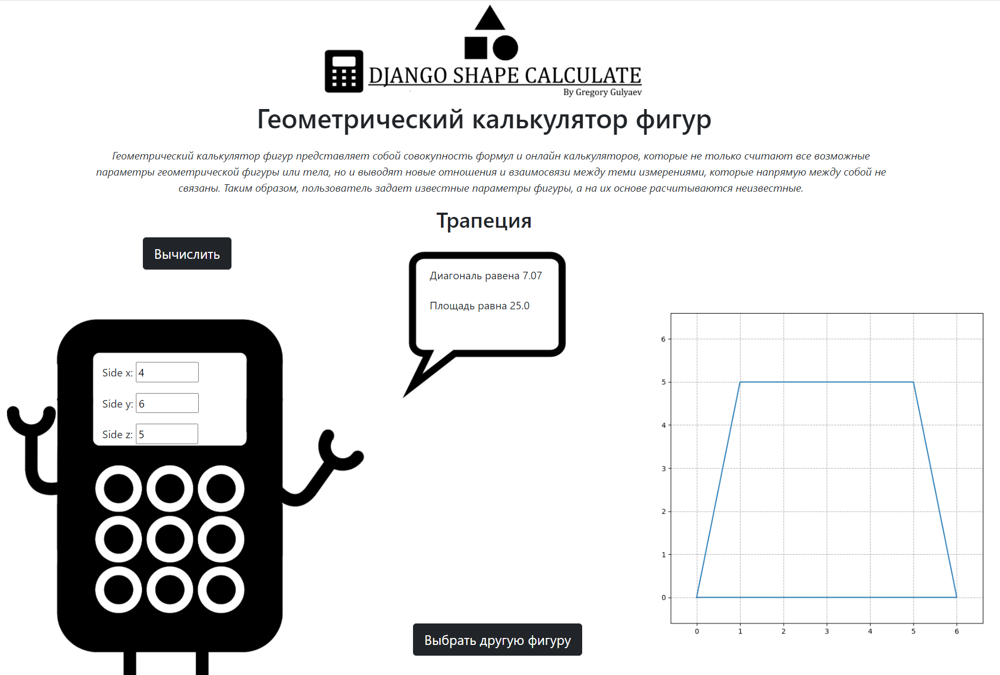

# DjangoShapeCalculate
The calculator is designed and implemented using the Django framework.

Plain figures: circle, square, rectangle, triangle, trapezium, rhombus.

Volumetric figures: sphere, cube, parallelepiped, pyramid, cylinder, cone.

The work used python3.10 and:

- Django 4.0.2
- Math
- Numpy
- Matplotlib

```shell
cd shape_calculate
```

```shell
python manage.py runserver
```
Starting development server at http://127.0.0.1:8000/





## If the pictures of the figures are not updated during the calculation
## Clear your browser hash (push CTRL + SHIFT + R on Google Chrome) 